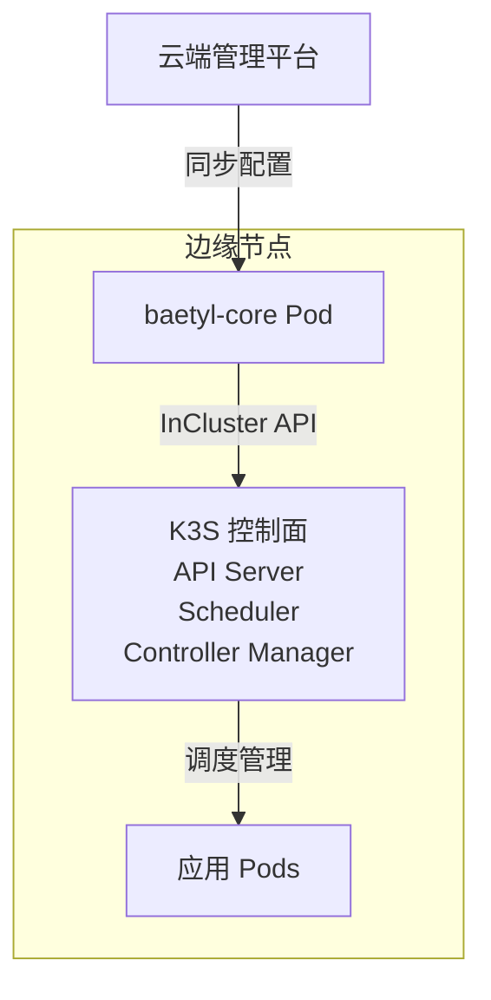

# Baetyl vs KubeEdge 架构对比

## 核心问题

**Q: Baetyl 项目的每个边缘节点都有独立的控制面 (API Server + Scheduler + Controller Manager) 吗?**

**A: 是的。** 在 Kube 模式下,Baetyl 的每个边缘节点都运行完整的 K3S 控制面。

---

## 架构差异对比

| 对比维度 | **Baetyl (Kube Mode)** | **KubeEdge** |
|---------|----------------------|--------------|
| **控制面位置** | ✅ 每个边缘节点都有独立的 K3S 控制面<br>(API Server + Scheduler + Controller Manager) | ❌ 边缘节点**无控制面**<br>只有 edged(类 kubelet 组件) |
| **调度决策** | 本地 Scheduler 独立调度 | 云端 K8S Scheduler 统一调度 |
| **API 访问方式** | 本地 `localhost:6443` | 通过 CloudHub 与云端通信 |
| **离线自治能力** | 完全自治(可独立运行) | 有限自治(依赖缓存的 Pod 列表) |
| **资源开销** | 大(~1GB 内存) | 小(~100MB) |
| **边缘组件** | K3S 完整发行版 | EdgeCore(edged + edgehub + ...) |

---

## 代码层面的证据

### 1. Baetyl 使用 InCluster 配置

文件: `ami/kube/kube_client.go:31-40`

```go
func newClient(cfg config.KubeConfig) (*client, error) {
    kubeConfig, err := func() (*rest.Config, error) {
        if !cfg.OutCluster {
            return rest.InClusterConfig()  // ← 期望本地有 K8S API Server
        }
        return clientcmd.BuildConfigFromFlags("", cfg.ConfPath)
    }()
    // ...
}
```

**关键点:**
- 默认 `OutCluster: false` 时使用 `rest.InClusterConfig()`
- 这意味着 baetyl-core 以 Pod 形式运行在**本地 K3S 集群内部**
- 直接通过 Service Account 访问本地 API Server

### 2. Baetyl 部署架构



**实际运行:**
```bash
# 边缘节点上的进程
systemd
├── k3s (独立进程,监听 6443 端口)
│   ├── kube-apiserver
│   ├── kube-scheduler
│   └── kube-controller-manager
└── containerd
    └── baetyl-core (Pod)
        └── 调用 https://kubernetes.default.svc:443
```

### 3. K3S 控制面代码位置

**重要说明:** Baetyl 项目**不包含**控制面代码,它只是 Kubernetes 客户端。

| 组件 | Baetyl 中的位置 | 实际控制面代码 |
|------|----------------|----------------|
| **API Server** | 无(仅客户端调用) | [k3s-io/k3s](https://github.com/k3s-io/k3s)/vendor/k8s.io/apiserver |
| **Scheduler** | 无 | k3s-io/k3s/vendor/k8s.io/kubernetes/pkg/scheduler |
| **Controller Manager** | 无 | k3s-io/k3s/vendor/k8s.io/kubernetes/pkg/controller |

**Baetyl 的角色:**
- `ami/kube/kube_client.go` - 创建 Kubernetes 客户端
- `ami/kube/kube_apply.go` - 调用 API 创建 Deployment/DaemonSet/Job
- `ami/kube/kube_collect.go` - 调用 API 查询 Pod 状态

依赖关系 (从 `go.mod`):
```go
k8s.io/client-go v0.28.2   // Kubernetes 客户端库
helm.sh/helm/v3 v3.13.1    // Helm 客户端
```

---

## 设计理念差异

### Baetyl 的设计目标

引用 `README.md:15-17`:
> especially suitable for **emerging strong edge devices**, such as **AI all-in-one machines** and **5G roadside boxes**

**优势:**
- ✅ 完全离线自治 - 断网后可独立运行
- ✅ K8S 原生体验 - 支持 Helm/YAML 等生态工具
- ✅ 本地调度决策 - 无需依赖云端
- ✅ 标准 K8S API - 易于集成第三方工具

**代价:**
- ❌ 资源占用大 - 最低 1GB 内存 (`README.md:50`)
- ❌ 控制面冗余 - 每个节点都有独立控制面

### KubeEdge 的设计目标

**优势:**
- ✅ 资源消耗低 - 适合弱边缘设备
- ✅ 云边协同 - 统一调度和管理
- ✅ 轻量级组件 - edged 替代 kubelet

**代价:**
- ❌ 离线能力有限 - 依赖云端调度
- ❌ 网络依赖 - 需要稳定的云边连接

---

## Baetyl 的两种模式

根据 `README.md:22`:

> The edge framework currently supports **Kube mode**. Because it runs on K3S, the overall resource overhead is relatively large (1G memory); the **Native mode** is under development, which can greatly reduce resource consumption.

### Kube Mode (当前)
```
边缘节点
├── K3S 控制面 (完整)
│   ├── API Server
│   ├── Scheduler
│   └── Controller Manager
└── baetyl-core (Pod)
```

### Native Mode (开发中)
```
边缘节点
└── baetyl-core (进程)
    └── 直接管理应用进程 (无 K8S)
```

**Native Mode 特点:**
- 不依赖 K3S
- 资源消耗极低
- 类似 KubeEdge 的轻量级设计
- 代码位置: `ami/native/`

---

## 总结

### 核心差异

1. **Baetyl (Kube 模式)**:
   - 每个边缘节点运行**独立的 K3S 控制面**
   - 完全自治,重量级方案

2. **KubeEdge**:
   - 边缘节点**没有任何控制面**
   - 云边协同,轻量级方案

### 适用场景

| 场景 | 推荐方案 |
|------|---------|
| 强边缘设备(AI 一体机、5G 路侧盒) | Baetyl Kube Mode |
| 弱边缘设备(ARM 开发板、传感器网关) | KubeEdge 或 Baetyl Native Mode |
| 要求完全离线自治 | Baetyl Kube Mode |
| 需要云边统一调度 | KubeEdge |
| 资源受限(内存 < 512MB) | KubeEdge |

### 技术实现证据链

```
配置文件
└── OutCluster: false (config/config.go:72)
    └── rest.InClusterConfig() (ami/kube/kube_client.go:34)
        └── 访问 https://kubernetes.default.svc
            └── 本地 K3S API Server (端口 6443)
                └── 独立的 Scheduler + Controller Manager
```

---

## 参考资料

- Baetyl 仓库: https://github.com/baetyl/baetyl
- KubeEdge 仓库: https://github.com/kubeedge/kubeedge
- K3S 仓库: https://github.com/k3s-io/k3s
- Baetyl 架构图: `docs/baetyl-arch-v2.svg`
- 核心配置: `config/config.go:71-75`
- K8S 客户端: `ami/kube/kube_client.go`
