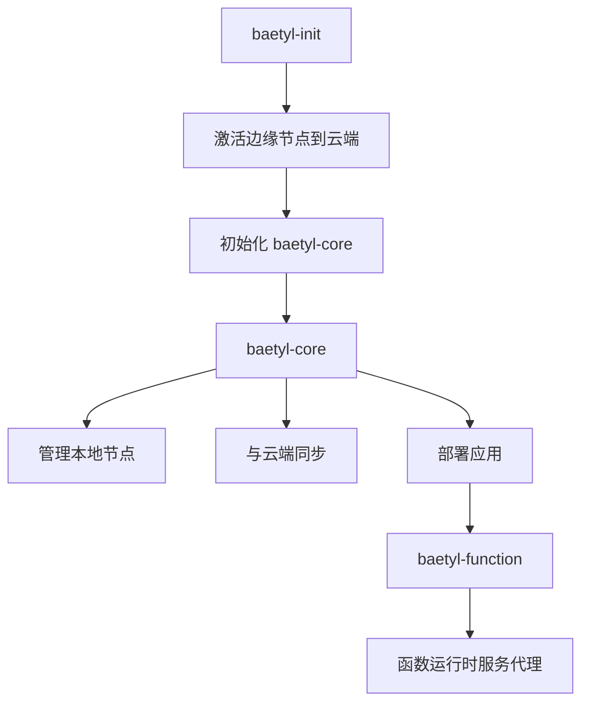

# Baetyl 项目概览

## 项目简介

Baetyl 是一个开源的边缘计算框架，无缝地将云计算、数据和服务扩展到边缘设备。基于 Go 语言开发，提供设备连接、消息路由、远程同步、函数计算和 AI 推理等边缘计算能力。

## 目录结构和主要职责

| 目录 | 主要职责 | 关键文件 |
|------|----------|----------|
| `cmd/` | CLI 命令处理和程序入口 | `baetyl.go`, `core.go`, `init.go`, `apply.go` |
| `core/` | 核心服务功能 | `core.go:StartCoreService` |
| `initz/` | 节点初始化服务 | `initz.go:StartInitService` |
| `engine/` | 应用部署和生命周期管理 | 应用管理逻辑 |
| `sync/` | 云边数据同步 | Shadow (Report/Desire) 模式实现 |
| `ami/` | 抽象机器接口 | |
| `├── ami/kube/` | Kubernetes 模式实现 | K8s 集群管理 |
| `├── ami/native/` | 原生模式实现（轻量级） | 本地进程管理 |
| `plugin/` | 插件系统 | |
| `├── plugin/httplink/` | HTTP 链路协议 | HTTP 通信协议 |
| `├── plugin/mqttlink/` | MQTT 链路协议 | MQTT 消息协议 |
| `├── plugin/wslink/` | WebSocket 链路协议 | WebSocket 连接 |
| `├── plugin/pubsub/` | 发布订阅消息 | 消息分发机制 |
| `├── plugin/nodestats/` | 节点统计收集 | 系统指标收集 |
| `├── plugin/nvstats/` | NVIDIA GPU 统计 | GPU 监控 |
| `├── plugin/qpsstats/` | QPS 统计 | 性能指标 |
| `store/` | 数据存储 | 本地数据持久化 |
| `config/` | 配置管理 | 配置文件处理 |
| `utils/` | 工具函数 | 通用工具库 |
| `security/` | 安全模块 | 安全相关功能 |
| `node/` | 节点管理 | 节点状态管理 |

## 构建和运行方式

### 构建命令

| 命令 | 说明 |
|------|------|
| `make all` | 构建当前平台的项目 |
| `make build` | 构建所有配置平台 |
| `make build-local` | 本地开发构建（生成 `baetyl` 二进制） |
| `go mod tidy` | 清理 Go 模块依赖 |

### 测试命令

| 命令 | 说明 |
|------|------|
| `make test` | 运行带覆盖率的单元测试（提交前必须运行） |
| `go test ./...` | 运行所有测试 |
| `go fmt ./...` | 格式化 Go 代码 |

### Docker 构建

| 命令 | 说明 |
|------|------|
| `make image` | 构建多平台 Docker 镜像 |

### 支持平台

- `darwin/amd64`
- `linux/amd64`
- `linux/arm64`
- `linux/arm/v7`
- `windows/amd64`

## 外部依赖

### 核心框架依赖

| 依赖 | 版本 | 用途 |
|------|------|------|
| `github.com/spf13/cobra` | v1.7.0 | CLI 框架 |
| `github.com/valyala/fasthttp` | v1.34.0 | 高性能 HTTP 服务 |
| `go.etcd.io/bbolt` | v1.3.7 | 本地键值存储 |

### Kubernetes 相关

| 依赖 | 版本 | 用途 |
|------|------|------|
| `helm.sh/helm/v3` | v3.13.1 | K8s 应用部署 |
| `k8s.io/client-go` | v0.28.2 | Kubernetes 客户端 |
| `k8s.io/api` | v0.28.2 | Kubernetes API |

### 通信协议

| 依赖 | 版本 | 用途 |
|------|------|------|
| `github.com/256dpi/gomqtt` | v0.14.3 | MQTT 协议 |
| `github.com/gorilla/websocket` | v1.4.2 | WebSocket 通信 |

### 系统监控

| 依赖 | 版本 | 用途 |
|------|------|------|
| `github.com/shirou/gopsutil/v3` | v3.22.9 | 系统信息采集 |

### 数据处理

| 依赖 | 版本 | 用途 |
|------|------|------|
| `gopkg.in/yaml.v3` | v3.0.1 | YAML 配置解析 |
| `github.com/timshannon/bolthold` | 数据库 ORM |

## 数据流架构

## 建议的新手阅读顺序

### 第一阶段：理解项目结构
1. **`main.go`** - 程序入口，了解服务注册机制
2. **`CLAUDE.md`** - 项目配置和开发指南
3. **`Makefile`** - 构建配置和命令
4. **`go.mod`** - 依赖关系

### 第二阶段：核心功能
5. **`cmd/baetyl.go`** - CLI 主命令结构
6. **`core/core.go:StartCoreService`** - 核心服务启动逻辑
7. **`initz/initz.go:StartInitService`** - 初始化服务
8. **`engine/`** - 应用管理引擎

### 第三阶段：同步机制
9. **`sync/`** - 云边同步机制（Shadow 模式）
10. **`store/`** - 本地数据存储

### 第四阶段：抽象接口
11. **`ami/`** - 抽象机器接口
12. **`ami/native/`** - 原生模式实现
13. **`ami/kube/`** - Kubernetes 模式实现

### 第五阶段：插件系统
14. **`plugin/httplink/`** - HTTP 通信插件
15. **`plugin/mqttlink/`** - MQTT 通信插件
16. **`plugin/pubsub/`** - 消息分发插件
17. **`plugin/*stats/`** - 各类统计插件

### 第六阶段：周边功能
18. **`config/`** - 配置管理
19. **`security/`** - 安全模块
20. **`utils/`** - 工具函数库

## 快速开始

1. **克隆代码**: `git clone <repository>`
2. **安装依赖**: `go mod tidy`
3. **本地构建**: `make build-local`
4. **运行测试**: `make test`
5. **查看帮助**: `./baetyl --help`

## 开发注意事项

- **测试要求**: 提交前必须运行 `make test`，所有单元测试和数据竞争测试必须通过
- **代码风格**: 遵循 [Go Code Review Comments](https://github.com/golang/go/wiki/CodeReviewComments)
- **Go 版本**: 要求 Go 1.18+
- **commit 规范**: 使用 `git commit --amend` 减少不必要的提交