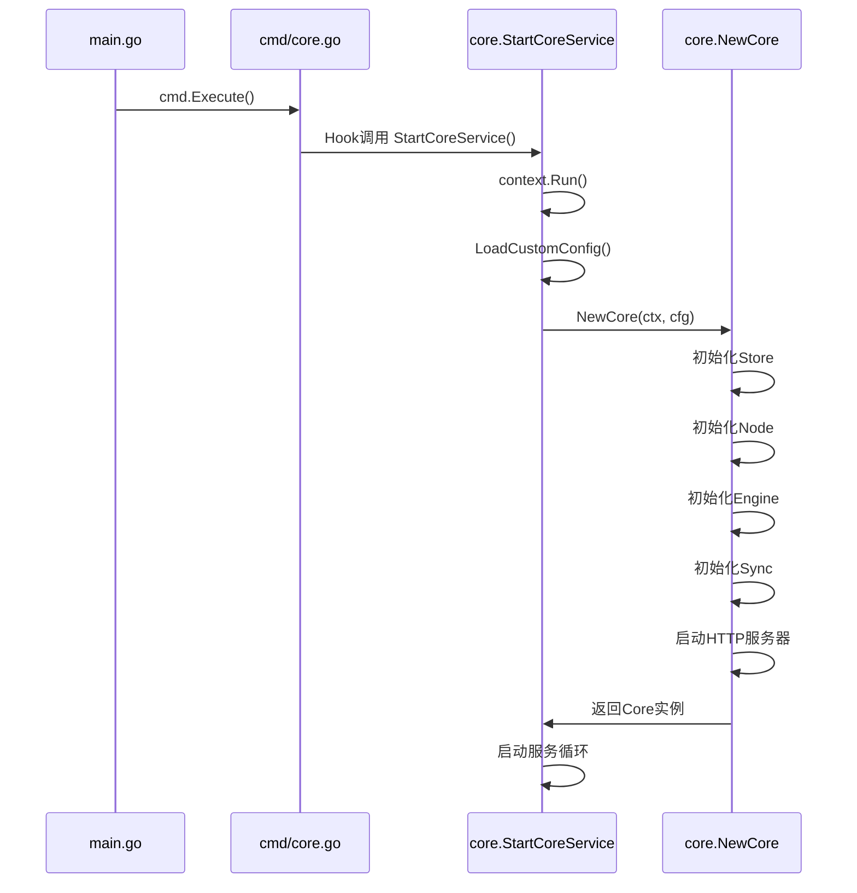
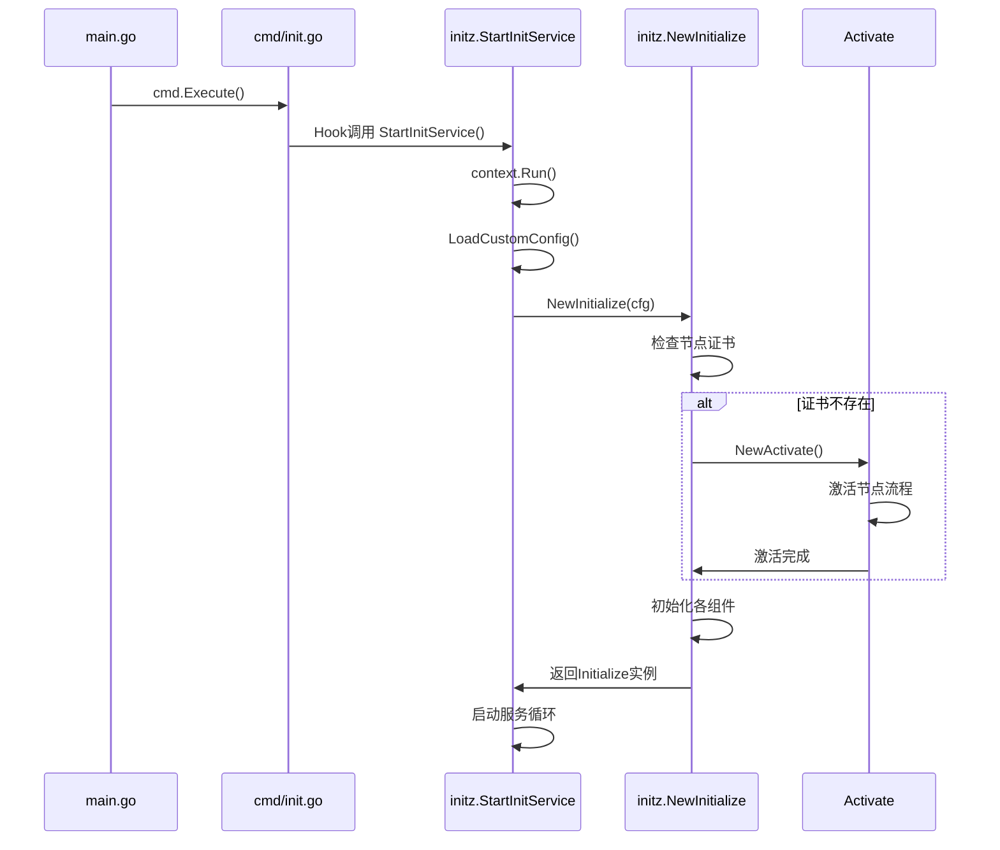

# Baetyl 程序入口与启动流程

## 程序入口文件

### 主要入口文件

| 文件路径 | 入口函数 | 用途 | 说明 |
|----------|----------|------|------|
| `main.go` | `func main()` | 主程序入口 | 注册服务钩子，执行CLI命令 |
| `cmd/demoprogram/main.go` | `func main()` | 演示程序 | 简单的日志输出演示程序 |

### 入口函数详情

#### 1. main.go:main()
```go
func main() {
    cmd.Execute()  // 执行Cobra CLI框架
}
```

#### 2. cmd/demoprogram/main.go:main()
```go
func main() {
    context.Run(func(ctx context.Context) error {
        // 演示程序：每秒输出日志
        for {
            select {
            case <-time.After(time.Second):
                ctx.Log().Info("log a message")
            case <-ctx.WaitChan():
                return nil
            }
        }
    })
}
```

## CLI 框架 (Cobra)

### 根命令
- **框架**: `github.com/spf13/cobra`
- **根命令**: `baetyl`
- **入口**: `cmd/baetyl.go:Execute()`

### 可用命令列表

| 命令 | 描述 | 实现文件 | 核心功能 |
|------|------|----------|----------|
| `baetyl core` | 运行核心服务 | `cmd/core.go` | 启动 `core.StartCoreService()` |
| `baetyl init` | 运行初始化服务 | `cmd/init.go` | 启动 `initz.StartInitService()` |
| `baetyl apply` | 应用部署 | `cmd/apply.go` | 部署应用到kube/native模式 |
| `baetyl delete` | 删除应用 | `cmd/delete.go` | 按命名空间删除应用 |
| `baetyl program` | 运行程序 | `cmd/program.go` | 加载program_service.yml运行程序 |
| `baetyl fingerprint` | 获取指纹 | `cmd/fingerprint.go` | 获取机器指纹用于激活 |
| `baetyl version` | 版本信息 | `cmd/version.go` | 显示版本信息 |
| `baetyl service` | 服务控制 | `cmd/service.go` | 系统服务管理 |

### 服务子命令

| 子命令 | 描述 | 用法示例 |
|--------|------|----------|
| `service start <name>` | 启动服务 | `baetyl service start myservice` |
| `service stop <name>` | 停止服务 | `baetyl service stop myservice` |
| `service restart <name>` | 重启服务 | `baetyl service restart myservice` |
| `service restart all` | 重启所有服务 | `baetyl service restart all` |
| `service list` | 列出所有服务 | `baetyl service list` |

## 服务框架与启动逻辑

### 主要服务框架

| 框架/库 | 用途 | 实现位置 |
|---------|------|----------|
| `github.com/valyala/fasthttp` | HTTP服务器 | `core/core.go` |
| `github.com/qiangxue/fasthttp-routing` | HTTP路由 | `core/core.go` |
| `github.com/baetyl/baetyl-go/v2/context` | 上下文管理 | 全局使用 |
| `github.com/kardianos/service` | 系统服务管理 | `cmd/service.go` |

### 钩子机制

通过 `main.go` 注册的服务钩子：

```go
func init() {
    cmd.Hooks[cmd.HookNameStartCoreService] = core.StartCoreServiceFunc(core.StartCoreService)
    cmd.Hooks[cmd.HookNameStartInitService] = initz.StartInitServiceFunc(initz.StartInitService)
    cmd.Hooks[cmd.HookGetFingerprint] = cmd.GetFingerprintFunc(cmd.GetFingerprint)
}
```

## 启动流程图

```mermaid
graph TD
    A[main.go] --> B[cmd.Execute()]
    B --> C{CLI命令解析}

    C -->|baetyl core| D[core.go]
    C -->|baetyl init| E[init.go]
    C -->|baetyl apply| F[apply.go]
    C -->|其他命令| G[其他命令处理]

    D --> D1[Hook调用 core.StartCoreService]
    E --> E1[Hook调用 initz.StartInitService]

    D1 --> D2[context.Run启动]
    E1 --> E2[context.Run启动]

    D2 --> D3[加载配置 ctx.LoadCustomConfig]
    E2 --> E3[加载配置 ctx.LoadCustomConfig]

    D3 --> D4[创建Core实例 NewCore]
    E3 --> E4[节点激活检查]

    E4 --> E5{节点证书存在?}
    E5 -->|否| E6[NewActivate激活节点]
    E5 -->|是| E7[创建Initialize实例]
    E6 --> E7

    D4 --> D5[初始化组件]
    E7 --> E8[初始化组件]

    D5 --> D6[启动HTTP服务器]
    D5 --> D7[启动同步服务]
    D5 --> D8[启动引擎服务]

    E8 --> E9[启动同步服务]
    E8 --> E10[启动引擎服务]

    F --> F1[应用部署流程]
    F1 --> F2[验证运行模式 kube/native]
    F2 --> F3[下载配置和应用定义]
    F3 --> F4[创建AMI实例]
    F4 --> F5[应用部署到运行时]
    F5 --> F6[监控应用状态]
```

## 详细启动序列

### 1. 核心服务启动 (baetyl core)



### 2. 初始化服务启动 (baetyl init)



## 配置加载顺序

1. **环境变量解析**: 设置运行模式 (`BAETYL_RUN_MODE`)
2. **配置文件加载**: `ctx.LoadCustomConfig(&cfg)`
3. **默认值设置**: `utils.SetDefaults(&cfg)`
4. **插件配置**: `plugin.ConfFile = ctx.ConfFile()`
5. **节点信息提取**: `utils.ExtractNodeInfo(cfg.Node)`

## 依赖初始化顺序

### Core 服务依赖链
1. **Store** (`store.NewBoltHold`) - 本地数据存储
2. **Node** (`node.NewNode`) - 节点管理
3. **Engine** (`engine.NewEngine`) - 应用引擎
4. **Sync** (`sync.NewSync`) - 云边同步
5. **HTTP Server** - API服务器
6. **EventX** - 事件系统
7. **DeviceManager** - 设备管理

### Init 服务依赖链
1. **Activate** (可选) - 节点激活
2. **Store** - 本地数据存储
3. **Node** - 节点管理
4. **Engine** - 应用引擎
5. **Sync** - 云边同步

## 运行模式

| 模式 | 说明 | 适用场景 |
|------|------|----------|
| `native` | 原生模式 | 轻量级边缘设备，直接进程管理 |
| `kube` | Kubernetes模式 | 容器化环境，K8s集群管理 |

模式通过环境变量 `BAETYL_RUN_MODE` 或命令行参数 `--mode` 指定。