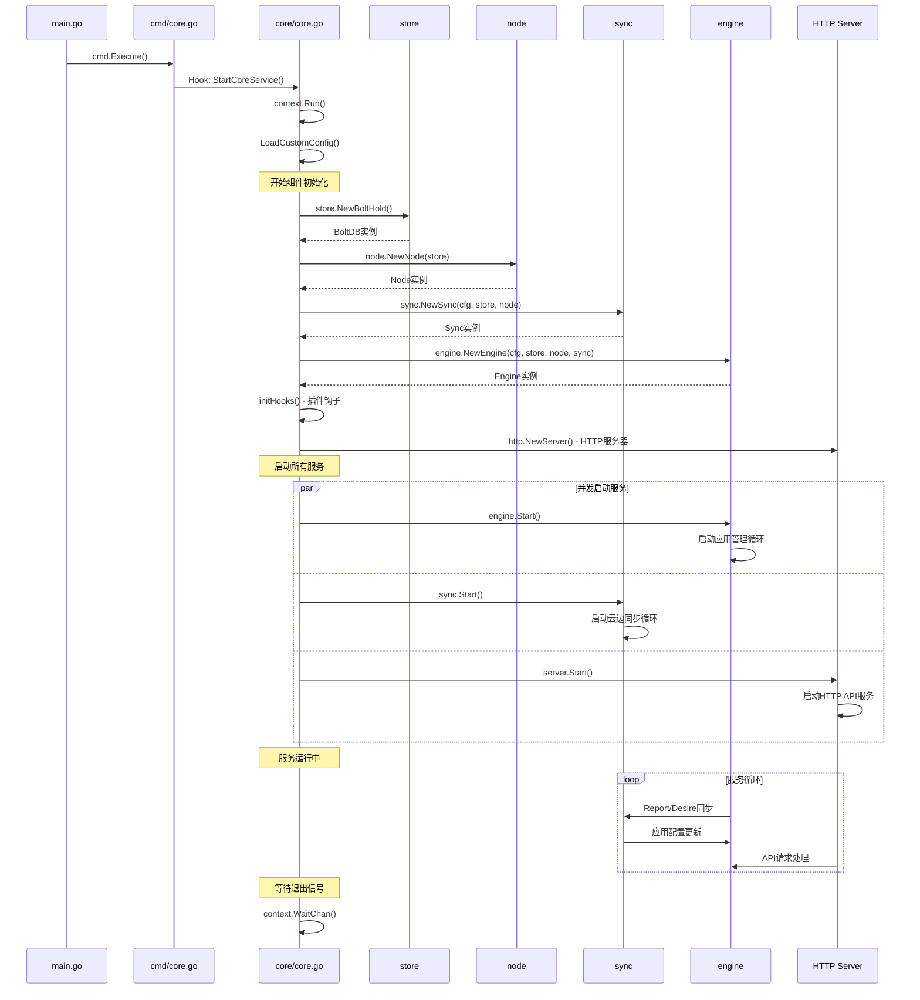
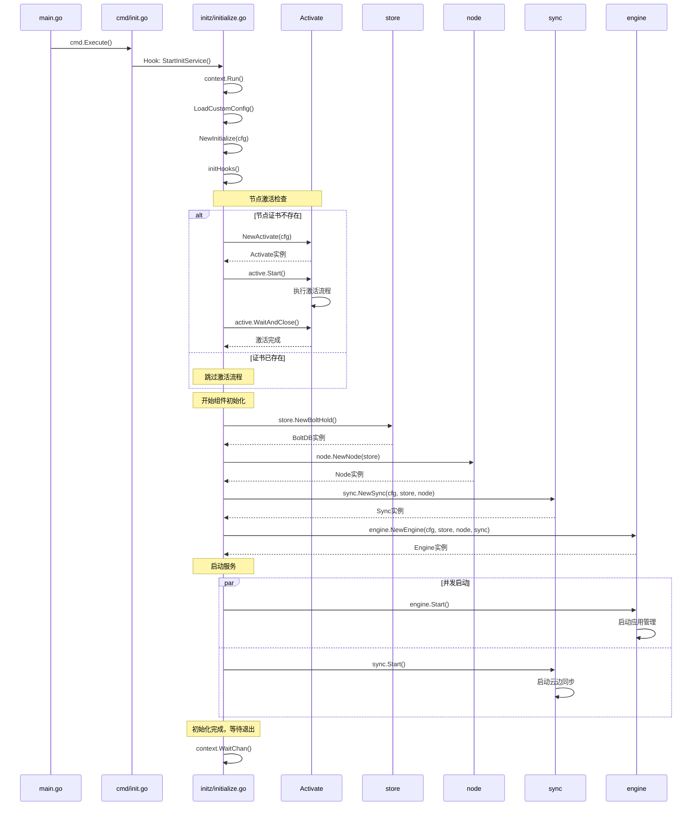

# Baetyl 核心调用链

## 核心服务调用链 (baetyl core)

### 主调用链
```
main() → main.go
├── cmd.Execute() → cmd/baetyl.go:Execute()
├── cobra.Command.Execute() → spf13/cobra框架
├── coreCmd.Run() → cmd/core.go:coreCmd
├── core.StartCoreService() → core/core.go:StartCoreService()
├── context.Run() → baetyl-go/v2/context
├── ctx.LoadCustomConfig() → 加载配置文件
├── core.NewCore() → core/core.go:NewCore()
│   ├── utils.ExtractNodeInfo() → utils/utils.go - 提取节点信息
│   ├── store.NewBoltHold() → store/bolthold.go - 创建本地存储
│   ├── node.NewNode() → node/node.go - 创建节点管理器
│   ├── sync.NewSync() → sync/sync.go - 创建同步服务
│   ├── agent.NewAgentClient() → agent/agent.go - 创建代理客户端
│   ├── engine.NewEngine() → engine/engine.go - 创建应用引擎
│   ├── initHooks() → core/core.go - 初始化钩子函数
│   ├── http.NewServer() → 创建HTTP服务器
│   ├── dm.NewDeviceManager() → dm/manager.go - 创建设备管理器
│   └── 启动各服务
│       ├── engine.Start() → 启动应用引擎
│       ├── sync.Start() → 启动同步服务
│       ├── server.Start() → 启动HTTP服务器
│       ├── dm.Start() → 启动设备管理器
│       └── eventx.Start() → 启动事件系统（可选）
└── context等待退出信号
```

### 函数功能说明

| 函数 | 文件路径 | 功能说明 |
|------|----------|----------|
| `main()` | `main.go:25` | 程序入口，注册钩子并启动CLI |
| `cmd.Execute()` | `cmd/baetyl.go:24` | 执行Cobra CLI命令框架 |
| `core.StartCoreService()` | `core/core.go:StartCoreService` | 核心服务启动函数，运行在context中 |
| `core.NewCore()` | `core/core.go:43` | 创建并初始化核心服务实例 |
| `utils.ExtractNodeInfo()` | `utils/utils.go:ExtractNodeInfo` | 从配置中提取节点标识信息 |
| `store.NewBoltHold()` | `store/bolthold.go:NewBoltHold` | 创建BoltDB本地数据存储 |
| `node.NewNode()` | `node/node.go:NewNode` | 创建节点管理实例，管理节点状态 |
| `sync.NewSync()` | `sync/sync.go:NewSync` | 创建云边同步服务实例 |
| `engine.NewEngine()` | `engine/engine.go:NewEngine` | 创建应用部署引擎实例 |
| `initHooks()` | `core/core.go:94` | 初始化各种插件钩子函数 |
| `engine.Start()` | `engine/engine.go:114` | 启动应用引擎服务循环 |
| `sync.Start()` | `sync/sync.go:104` | 启动云边同步服务循环 |

## 初始化服务调用链 (baetyl init)

### 主调用链
```
main() → main.go
├── cmd.Execute() → cmd/baetyl.go:Execute()
├── initCmd.Run() → cmd/init.go:initCmd
├── initz.StartInitService() → initz/initialize.go:StartInitService()
├── context.Run() → baetyl-go/v2/context
├── ctx.LoadCustomConfig() → 加载配置文件
├── initz.NewInitialize() → initz/initialize.go:NewInitialize()
│   ├── initHooks() → initz/initialize.go - 初始化钩子
│   ├── 节点激活检查
│   │   ├── v2utils.FileExists() → 检查节点证书文件
│   │   └── 如果证书不存在
│   │       ├── NewActivate() → initz/activate.go - 创建激活器
│   │       ├── active.Start() → 启动激活流程
│   │       └── active.WaitAndClose() → 等待激活完成
│   ├── utils.ExtractNodeInfo() → 提取节点信息
│   ├── store.NewBoltHold() → 创建本地存储
│   ├── node.NewNode() → 创建节点管理器
│   ├── sync.NewSync() → 创建同步服务
│   ├── engine.NewEngine() → 创建应用引擎
│   └── 启动服务
│       ├── engine.Start() → 启动应用引擎
│       └── sync.Start() → 启动同步服务
└── 运行服务循环直到接收退出信号
```

### 节点激活子调用链
```
NewActivate() → initz/activate.go:NewActivate()
├── 创建激活配置
├── 设置HTTP客户端
└── Start() → initz/activate.go:Start()
    ├── 检查激活模式（collector/server）
    ├── collector模式
    │   ├── NewActivateCollector() → 创建收集器激活
    │   └── 收集设备信息并上报云端
    └── server模式
        ├── NewActivateServer() → 创建服务器激活
        └── 等待云端激活指令
```

## 应用部署调用链 (baetyl apply)

### 主调用链
```
main() → main.go
├── applyCmd.Run() → cmd/apply.go:applyCmd
├── apply() → cmd/apply.go:apply()
│   ├── 环境准备
│   │   ├── 验证运行模式(kube/native)
│   │   ├── os.Setenv() → 设置运行模式环境变量
│   │   └── context.HostPathLib() → 获取主机路径
│   ├── 数据下载
│   │   ├── http.NewClient() → 创建HTTP客户端
│   │   ├── 从URL或文件读取配置
│   │   └── utils.ParseEnv() → 解析环境变量
│   ├── 配置解析
│   │   ├── json.Unmarshal() → 解析JSON配置
│   │   └── 分类资源(apps/configs/secrets)
│   ├── 配置下载
│   │   ├── sync.FilterConfig() → 过滤配置
│   │   └── sync.DownloadConfig() → 下载配置对象
│   ├── AMI初始化
│   │   ├── utils.SetDefaults() → 设置默认配置
│   │   └── ami.NewAMI() → 创建AMI实例
│   └── 应用部署
│       ├── os.MkdirAll() → 创建主机路径
│       ├── sync.PrepareApp() → 准备应用资源
│       ├── am.ApplyApp() → 部署应用到运行时
│       └── 监控应用状态直到运行成功
└── 等待信号退出
```

## 关键分支和错误处理

### 🔴 错误处理模式
所有核心函数都使用 `errors.Trace(err)` 进行错误链追踪：

```go
// 典型错误处理模式
func NewCore(ctx context.Context, cfg config.Config) (*Core, error) {
    err := utils.ExtractNodeInfo(cfg.Node)
    if err != nil {
        return nil, errors.Trace(err)  // 🔴 错误链追踪
    }
    // ... 更多初始化步骤
}
```

### 🟡 条件分支处理

#### 1. 节点激活分支
```go
// initz/initialize.go:40
if !v2utils.FileExists(cfg.Node.Cert) {
    // 🟡 证书不存在 → 激活流程
    active, err := NewActivate(&cfg)
    // 激活处理...
} else {
    // 🟡 证书存在 → 直接初始化
}
```

#### 2. 运行模式分支
```go
// 支持两种运行模式
modes := map[string]struct{}{
    context.RunModeKube:   {},    // 🟡 Kubernetes模式
    context.RunModeNative: {},    // 🟡 Native模式
}
```

#### 3. 可选服务分支
```go
// core/core.go:84
if cfg.Event.Notify {
    // 🟡 事件系统可选启动
    c.evt, err = eventx.NewEventX(ctx, cfg)
    if err != nil {
        return nil, errors.Trace(err)
    }
    c.evt.Start()
}
```

### 🟢 并发执行模式

#### 1. 并行应用部署
```go
// engine/engine.go:383
go func(wg *gosync.WaitGroup, info specv1.AppInfo) {
    // 🟢 并发部署多个应用
    defer wg.Done()
    // 应用部署逻辑
}(wg, app)
```

#### 2. 链式消息处理
```go
// chain/chain.go:172
go func() {
    // 🟢 异步消息链处理
    // 消息处理逻辑
}()
```

#### 3. 同步对象下载
```go
// sync/object_test.go:122
go func(wg *gosync.WaitGroup) {
    // 🟢 并发下载对象
    defer wg.Done()
    // 下载逻辑
}(wg)
```

### 🔵 中间件和处理器模式

#### 1. 消息处理器
```go
// sync/msg_handler.go:13
func (h *handler) OnMessage(msg interface{}) error {
    // 🔵 同步消息处理中间件
    return h.link.Send(msg.(*v1.Message))
}

func (h *handler) OnTimeout() error {
    // 🔵 超时处理中间件
    msg := &v1.Message{
        Kind: v1.MessageData,
        Metadata: map[string]string{
            "success": "false",
            "msg":     "sync timeout",
        },
    }
    return h.link.Send(msg)
}
```

#### 2. HTTP路由处理器
```go
// core/core.go HTTP服务器使用fasthttp-routing
c.svr = http.NewServer(cfg.Server, c.initRouter())
// initRouter() 设置HTTP路由处理器
```

## 主干调用链时序图



## 初始化服务时序图



## 调用链特点总结

### 1. 分层架构
- **CLI层**: Cobra命令处理
- **服务层**: Core/Init服务逻辑
- **组件层**: Store/Node/Sync/Engine
- **基础层**: HTTP/Plugin/Context

### 2. 依赖注入
- 各组件通过构造函数注入依赖
- Store → Node → Sync → Engine 的依赖链

### 3. 钩子机制
- 插件系统通过钩子函数扩展功能
- AMI、Sync、Engine都支持钩子扩展

### 4. 错误处理
- 统一使用 `errors.Trace()` 追踪错误链
- 每层都进行错误检查和传播

### 5. 并发模式
- 使用goroutine并发启动服务
- WaitGroup协调并发任务完成
- Context管理服务生命周期