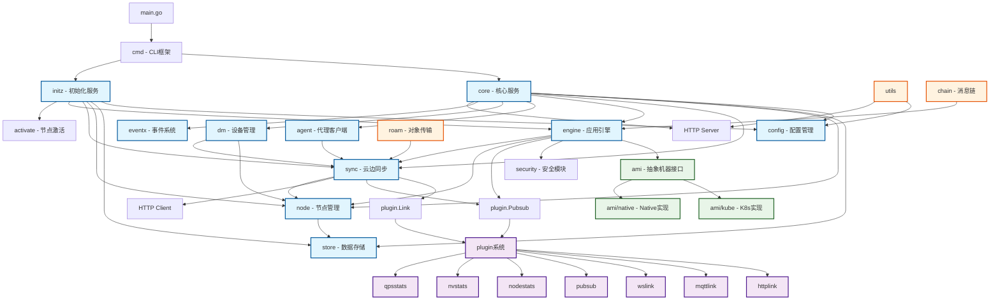

# Baetyl 模块依赖与数据流

## 模块依赖关系图



## 重要数据结构

### 核心配置结构

#### 1. Config (config/config.go)
```go
type Config struct {
    Node     utils.Certificate `yaml:"node" json:"node"`          // 节点证书配置
    Engine   EngineConfig      `yaml:"engine" json:"engine"`      // 引擎配置
    AMI      AmiConfig         `yaml:",inline" json:",inline"`    // AMI配置
    Sync     SyncConfig        `yaml:"sync" json:"sync"`          // 同步配置
    Store    StoreConfig       `yaml:"store" json:"store"`        // 存储配置
    Event    EventConfig       `yaml:"event" json:"event"`        // 事件配置
    Security SecurityConfig    `yaml:"security" json:"security"`  // 安全配置
    Server   http.ServerConfig `yaml:"server" json:"server"`      // 服务器配置
    Logger   log.Config        `yaml:"logger" json:"logger"`      // 日志配置
}
```
**职责**: 系统全局配置管理，包含所有模块的配置参数

#### 2. Core (core/core.go)
```go
type Core struct {
    cfg config.Config      // 配置实例
    sto *bh.Store         // BoltDB存储
    nod node.Node         // 节点管理器
    eng engine.Engine     // 应用引擎
    syn sync.Sync         // 云边同步
    svr *http.Server      // HTTP服务器
    agt agent.AgentClient // 代理客户端
    evt eventx.EventX     // 事件系统
    dm  dm.DeviceManager  // 设备管理器
}
```
**职责**: 核心服务容器，管理所有子模块的生命周期

### 引擎相关结构

#### 3. engineImpl (engine/engine.go)
```go
type engineImpl struct {
    mode            string              // 运行模式(kube/native)
    hostHostPath    string              // 主机路径
    objectHostPath  string              // 对象路径
    cfg             config.Config       // 配置引用
    syn             sync.Sync           // 同步服务
    ami             ami.AMI             // 抽象机器接口
    nod             node.Node           // 节点管理
    sto             *bh.Store          // 数据存储
    sec             security.Security   // 安全模块
    pb              plugin.Pubsub      // 发布订阅插件
    agentClient     agent.AgentClient  // 代理客户端
    downsideChan    <-chan interface{} // 下行消息通道
    downsideProcess pubsub.Processor   // 下行消息处理器
    chains          gosync.Map         // 消息链映射
    tomb            v2utils.Tomb       // 生命周期管理
}
```
**职责**: 应用生命周期管理，包括部署、监控、销毁

### 同步相关结构

#### 4. sync (sync/sync.go)
```go
type sync struct {
    cfg      config.Config   // 配置
    link     plugin.Link     // 链路插件
    store    *bh.Store      // 本地存储
    nod      node.Node      // 节点管理
    tomb     utils.Tomb     // 生命周期
    log      *log.Logger    // 日志器
    download *http.Client   // 下载客户端
    pb       plugin.Pubsub  // 发布订阅
}
```
**职责**: 云边数据同步，采用Shadow(Report/Desire)模式

### 节点相关结构

#### 5. node (node/node.go)
```go
type node struct {
    tomb  utils.Tomb   // 生命周期管理
    log   *log.Logger  // 日志器
    id    []byte       // 节点ID
    store *bh.Store    // 本地存储
    mqtt  *mqtt.Client // MQTT客户端
}
```
**职责**: 节点状态管理，维护节点信息和状态数据

### 初始化相关结构

#### 6. Initialize (initz/initialize.go)
```go
type Initialize struct {
    cfg  config.Config  // 配置
    sto  *bh.Store     // 存储
    nod  node.Node     // 节点管理
    eng  engine.Engine // 应用引擎
    syn  sync.Sync     // 同步服务
    log  *log.Logger   // 日志器
    tomb v2utils.Tomb  // 生命周期
}
```
**职责**: 节点初始化和激活流程管理

#### 7. Activate (initz/activate.go)
```go
type Activate struct {
    cfg    *config.Config     // 配置引用
    client *http.Client       // HTTP客户端
    server *http.Server       // HTTP服务器
    tomb   v2utils.Tomb       // 生命周期
    log    *log.Logger        // 日志器
}
```
**职责**: 节点激活流程，与云端建立信任关系

## 典型请求处理流程

### 1. HTTP API 请求流程

#### 节点状态查询 (GET /node/stats)
```
HTTP Request → FastHTTP Router → utils.Wrapper() → node.GetStats() → BoltDB Query → JSON Response
```

**详细步骤**:
1. **输入**: HTTP GET 请求 `/node/stats`
2. **路由层**: FastHTTP Router 匹配路由规则
3. **中间件层**: `utils.Wrapper()` 提供统一的错误处理和响应格式化
4. **服务层**: `node.GetStats()` 收集节点统计信息
5. **存储层**: 从 BoltDB 读取节点状态数据
6. **输出**: JSON 格式的节点统计信息

#### 服务日志查询 (GET /services/<service>/log)
```
HTTP Request → FastHTTP Router → engine.GetServiceLog() → AMI.CollectLogs() → Container Runtime → Log Stream
```

**详细步骤**:
1. **输入**: HTTP GET 请求 `/services/{service}/log`
2. **路由层**: 提取服务名参数
3. **引擎层**: `engine.GetServiceLog()` 处理日志请求
4. **AMI层**: 根据运行模式(kube/native)调用相应实现
5. **运行时层**: 从容器运行时或进程获取日志
6. **输出**: 实时日志流或历史日志

### 2. 云边同步流程

#### Report-Desire 同步模式
```
Node Report → Sync.Report() → Link.Send() → Cloud Processing → Desire Response → Engine.Apply()
```

**详细步骤**:
1. **输入**: 节点状态报告(Report)
2. **同步层**: `sync.Report()` 构造报告消息
3. **链路层**: 通过 Link 插件发送到云端
4. **云端处理**: 云端分析报告并生成期望状态(Desire)
5. **期望下发**: 云端将期望状态推送到边缘节点
6. **应用层**: `engine` 根据期望状态部署或更新应用

### 3. 应用部署流程

#### 应用生命周期管理
```
Desire Configuration → Engine.ProcessDesire() → AMI.ApplyApp() → Container Runtime → Application Running
```

**详细步骤**:
1. **输入**: 来自云端的应用期望配置
2. **引擎层**: `engine` 解析应用配置
3. **安全层**: `security` 生成应用证书和密钥
4. **准备阶段**: 下载应用镜像和配置文件
5. **部署层**: AMI 根据模式调用 K8s 或 Native 实现
6. **运行时**: 容器运行时或进程管理器启动应用
7. **监控**: 持续监控应用状态并上报

### 4. 节点激活流程

#### 首次激活 (Collector模式)
```
Fingerprint Collection → Activation Request → Cloud Verification → Certificate Issuance → Node Registration
```

**详细步骤**:
1. **输入**: 节点指纹信息
2. **收集层**: 收集设备硬件和软件信息
3. **激活层**: `activate` 向云端发送激活请求
4. **云端验证**: 云端验证节点身份和权限
5. **证书下发**: 云端签发节点证书
6. **本地存储**: 将证书保存到本地存储
7. **注册完成**: 节点注册成功，可以开始正常通信

## API 接口列表

| 路径 | 方法 | 入参 | 出参 | 中间件 | 功能说明 |
|------|------|------|------|--------|----------|
| `/node/stats` | GET | 无 | NodeStats JSON | utils.Wrapper | 获取节点统计信息 |
| `/services/<service>/log` | GET | service路径参数 | Log Stream | 无 | 获取服务日志 |
| `/node/properties` | GET | 无 | NodeProperties JSON | utils.Wrapper | 获取节点属性 |
| `/node/properties` | PUT | Properties JSON | Success Response | utils.Wrapper | 更新节点属性 |
| `/agent/sts` | POST | STS Request JSON | STS Token JSON | utils.Wrapper | 获取临时安全令牌 |
| `/sync/state` | GET | 无 | Link State JSON | utils.Wrapper | 获取同步链路状态 |

### API 详细说明

#### 1. 节点统计接口
- **路径**: `/node/stats`
- **方法**: GET
- **入参**: 无
- **出参**:
```json
{
  "cpu": {"usage": 45.2},
  "memory": {"total": 8192, "used": 3456},
  "disk": {"total": 100000, "used": 25000},
  "network": {"rx": 1234567, "tx": 987654}
}
```
- **处理流程**: HTTP → Router → Wrapper → Node.GetStats → BoltDB → JSON

#### 2. 服务日志接口
- **路径**: `/services/{service}/log`
- **方法**: GET
- **查询参数**:
  - `follow`: 是否跟踪日志流
  - `tail`: 返回最后N行
  - `since`: 时间戳，返回此时间后的日志
- **出参**: 日志文本流或JSON格式日志
- **处理流程**: HTTP → Router → Engine.GetServiceLog → AMI → Runtime → LogStream

#### 3. 节点属性接口
- **路径**: `/node/properties`
- **方法**: GET/PUT
- **PUT 入参**:
```json
{
  "properties": {
    "location": "beijing",
    "environment": "production"
  }
}
```
- **处理流程**: HTTP → Router → Wrapper → Node.UpdateNodeProperties → BoltDB

#### 4. 代理STS接口
- **路径**: `/agent/sts`
- **方法**: POST
- **入参**:
```json
{
  "resource": "cloud-service",
  "action": "read"
}
```
- **出参**:
```json
{
  "accessKeyId": "temp_key_id",
  "secretAccessKey": "temp_secret",
  "sessionToken": "session_token",
  "expiration": "2024-01-01T12:00:00Z"
}
```

## 数据流特点

### 1. 分层架构
- **接口层**: HTTP API, CLI命令
- **服务层**: Core, Engine, Sync, Node
- **存储层**: BoltDB, 文件系统
- **运行时层**: K8s, Docker, 进程管理

### 2. 插件化设计
- **Link插件**: HTTP, MQTT, WebSocket通信
- **Pubsub插件**: 消息发布订阅
- **Stats插件**: GPU, 节点, QPS统计

### 3. 异步处理
- 使用 Channel 和 Goroutine 实现异步消息处理
- Pubsub 模式解耦组件间通信
- Tomb 管理异步任务生命周期

### 4. 错误处理
- 统一的错误链追踪 `errors.Trace()`
- 中间件层统一错误响应格式
- 恐慌恢复机制保证服务稳定性

### 5. 配置驱动
- 所有模块通过配置文件驱动行为
- 支持环境变量和默认值
- 热重载配置更新应用状态