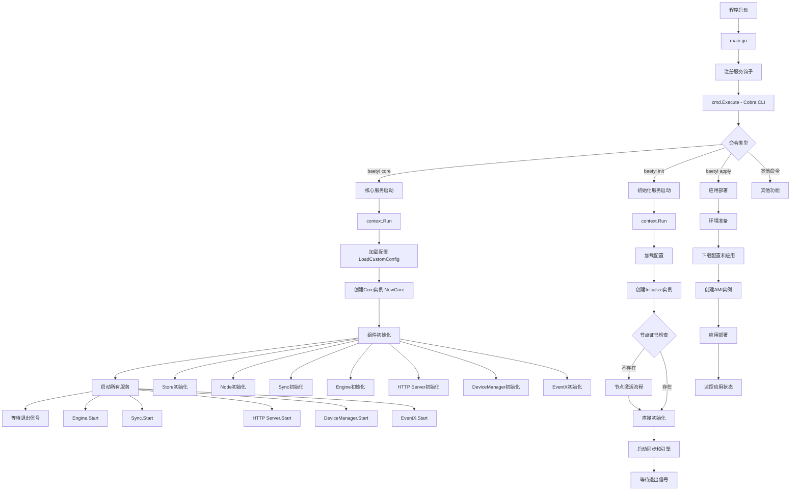
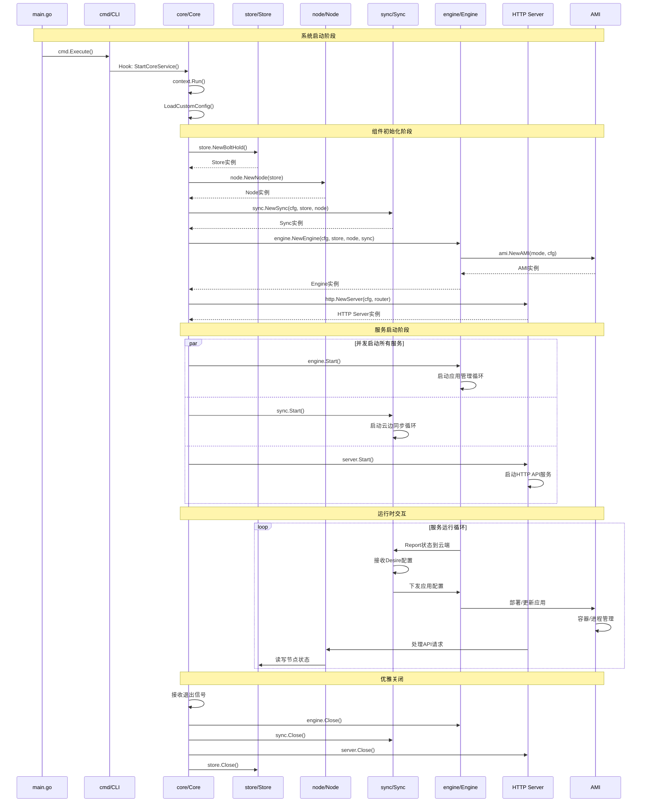

# Baetyl 系统架构文档

## 系统整体架构综述

Baetyl 是一个开源的边缘计算框架，采用云原生架构设计，旨在将云计算能力无缝扩展到边缘设备。系统基于 Go 语言开发，具备高性能、高可用性和强扩展性的特点。

### 核心设计理念

1. **云边协同**: 通过 Report-Desire 模式实现云端和边缘的状态同步
2. **插件化架构**: 支持多种通信协议和运行时的可插拔设计
3. **双模式运行**: 支持 Kubernetes 和 Native 两种部署模式
4. **安全优先**: 内置 PKI 证书体系和安全通信机制
5. **轻量化**: 适配资源受限的边缘设备环境

### 系统特性

- **多协议支持**: HTTP、MQTT、WebSocket 等多种通信协议
- **应用管理**: 完整的应用生命周期管理（部署、监控、更新、销毁）
- **数据同步**: 实时的云边数据同步和状态管理
- **设备管理**: 统一的边缘设备接入和管理
- **监控统计**: 全面的系统和应用性能监控
- **安全机制**: 端到端的安全通信和访问控制

## 顶层目录结构表

| 目录 | 作用 | 关键文件 | 说明 |
|------|------|----------|------|
| `cmd/` | CLI命令处理 | `baetyl.go`, `core.go`, `init.go`, `apply.go` | Cobra框架实现的命令行工具 |
| `core/` | 核心服务 | `core.go` | 主要的核心服务逻辑和HTTP API |
| `initz/` | 初始化服务 | `initialize.go`, `activate.go` | 节点初始化和激活流程 |
| `engine/` | 应用引擎 | `engine.go`, `msg_handler.go` | 应用生命周期管理和消息处理 |
| `sync/` | 云边同步 | `sync.go`, `object.go` | Shadow模式的云边数据同步 |
| `node/` | 节点管理 | `node.go` | 节点状态管理和信息维护 |
| `ami/` | 抽象机器接口 | | 运行时抽象层 |
| `├── ami/kube/` | Kubernetes实现 | `kube.go`, `kube_client.go` | K8s集群的应用管理实现 |
| `├── ami/native/` | Native实现 | `native.go` | 本地进程的应用管理实现 |
| `plugin/` | 插件系统 | | 可插拔的功能扩展 |
| `├── plugin/httplink/` | HTTP链路 | `httplink.go` | HTTP通信协议实现 |
| `├── plugin/mqttlink/` | MQTT链路 | `mqttlink.go` | MQTT通信协议实现 |
| `├── plugin/wslink/` | WebSocket链路 | `wslink.go` | WebSocket通信协议实现 |
| `├── plugin/pubsub/` | 发布订阅 | `pubsub.go` | 消息发布订阅机制 |
| `├── plugin/nodestats/` | 节点统计 | `nodestats.go` | 系统资源统计收集 |
| `├── plugin/nvstats/` | GPU统计 | `nvstats.go` | NVIDIA GPU统计收集 |
| `├── plugin/qpsstats/` | QPS统计 | `qpsstats.go` | 服务QPS性能统计 |
| `config/` | 配置管理 | `config.go` | 系统配置结构和管理 |
| `store/` | 数据存储 | `bolthold.go` | BoltDB本地数据存储 |
| `security/` | 安全模块 | `pki.go` | PKI证书管理和安全通信 |
| `agent/` | 代理客户端 | `agent.go` | 云端代理通信客户端 |
| `dm/` | 设备管理 | `manager.go` | 边缘设备接入和管理 |
| `eventx/` | 事件系统 | `eventx.go`, `handler.go` | 事件发布和处理机制 |
| `chain/` | 消息链 | `chain.go` | 消息链路管理和处理 |
| `roam/` | 对象传输 | `roam.go` | 对象上传和传输服务 |
| `utils/` | 工具函数 | `http.go`, `parse.go` | 通用工具和HTTP处理器 |
| `common/` | 公共模块 | `send_keeper.go` | 公共数据结构和工具 |
| `fingerprint/` | 指纹识别 | `fingerprint.go` | 设备指纹生成和识别 |
| `program/` | 程序管理 | `program.go` | 用户程序的运行管理 |
| `mock/` | 测试模拟 | `*.go` | 单元测试的Mock对象 |
| `docs/` | 文档目录 | `*.md` | 项目文档和说明 |
| `demo/` | 演示程序 | | 示例程序和演示代码 |
| `res/` | 资源文件 | | 静态资源和配置模板 |

## 启动流程图



## 核心调用链时序图



## 模块依赖关系图

```mermaid
graph TD
    subgraph "CLI层"
        CLI[cmd - CLI框架]
    end

    subgraph "服务层"
        CORE[core - 核心服务]
        INIT[initz - 初始化服务]
    end

    subgraph "业务层"
        ENGINE[engine - 应用引擎]
        SYNC[sync - 云边同步]
        NODE[node - 节点管理]
        AGENT[agent - 代理客户端]
        DM[dm - 设备管理]
        EVENTX[eventx - 事件系统]
    end

    subgraph "抽象层"
        AMI[ami - 抽象机器接口]
        KUBE[ami/kube - K8s实现]
        NATIVE[ami/native - Native实现]
    end

    subgraph "插件层"
        PLUGIN[plugin - 插件系统]
        HTTPLINK[httplink - HTTP协议]
        MQTTLINK[mqttlink - MQTT协议]
        WSLINK[wslink - WebSocket协议]
        PUBSUB[pubsub - 发布订阅]
        STATS[stats插件集合]
    end

    subgraph "基础层"
        CONFIG[config - 配置管理]
        STORE[store - 数据存储]
        SECURITY[security - 安全模块]
        UTILS[utils - 工具函数]
        CHAIN[chain - 消息链]
        ROAM[roam - 对象传输]
    end

    CLI --> CORE
    CLI --> INIT

    CORE --> ENGINE
    CORE --> SYNC
    CORE --> NODE
    CORE --> AGENT
    CORE --> DM
    CORE --> EVENTX

    INIT --> NODE
    INIT --> SYNC
    INIT --> ENGINE

    ENGINE --> AMI
    ENGINE --> SECURITY
    ENGINE --> PUBSUB

    SYNC --> PLUGIN
    SYNC --> NODE

    AMI --> KUBE
    AMI --> NATIVE

    PLUGIN --> HTTPLINK
    PLUGIN --> MQTTLINK
    PLUGIN --> WSLINK
    PLUGIN --> PUBSUB
    PLUGIN --> STATS

    ENGINE --> CHAIN
    SYNC --> ROAM

    %% 基础依赖
    CORE --> CONFIG
    CORE --> STORE
    INIT --> CONFIG
    INIT --> STORE
    ENGINE --> CONFIG
    ENGINE --> STORE
    SYNC --> CONFIG
    SYNC --> STORE
    NODE --> STORE

    %% 工具依赖
    CORE --> UTILS
    ENGINE --> UTILS
    SYNC --> UTILS

    classDef cliLayer fill:#e3f2fd,stroke:#1976d2,stroke-width:2px
    classDef serviceLayer fill:#f3e5f5,stroke:#7b1fa2,stroke-width:2px
    classDef businessLayer fill:#e8f5e8,stroke:#388e3c,stroke-width:2px
    classDef abstractLayer fill:#fff3e0,stroke:#f57c00,stroke-width:2px
    classDef pluginLayer fill:#fce4ec,stroke:#c2185b,stroke-width:2px
    classDef baseLayer fill:#f5f5f5,stroke:#616161,stroke-width:2px

    class CLI cliLayer
    class CORE,INIT serviceLayer
    class ENGINE,SYNC,NODE,AGENT,DM,EVENTX businessLayer
    class AMI,KUBE,NATIVE abstractLayer
    class PLUGIN,HTTPLINK,MQTTLINK,WSLINK,PUBSUB,STATS pluginLayer
    class CONFIG,STORE,SECURITY,UTILS,CHAIN,ROAM baseLayer
```



## 外部依赖

### 数据库
| 类型 | 名称 | 版本 | 用途 | 配置项 |
|------|------|------|------|--------|
| 嵌入式数据库 | BoltDB | v1.3.7 | 本地状态存储 | `store.path` |

### 消息队列
| 类型 | 名称 | 版本 | 用途 | 配置项 |
|------|------|------|------|--------|
| MQTT Broker | gomqtt | v0.14.3 | MQTT消息通信 | `mqttlink.*` |
| 内置Pubsub | defaultpubsub | 内置 | 内部消息分发 | `plugin.pubsub` |

### 容器运行时
| 类型 | 名称 | 版本 | 用途 | 配置项 |
|------|------|------|------|--------|
| 容器编排 | Kubernetes | v0.28.2 | 容器应用管理 | `kube.*` |
| 容器运行时 | Docker/containerd | 兼容 | 容器运行环境 | 系统配置 |
| 包管理 | Helm | v3.13.1 | K8s应用部署 | 内置集成 |

### HTTP客户端/服务器
| 类型 | 名称 | 版本 | 用途 | 配置项 |
|------|------|------|------|--------|
| HTTP框架 | FastHTTP | v1.34.0 | 高性能HTTP服务 | `server.*` |
| HTTP路由 | fasthttp-routing | 内置 | HTTP路由处理 | 代码配置 |
| HTTP客户端 | baetyl-go/http | v2.x | HTTP客户端请求 | `sync.download.*` |

### 第三方API
| 服务 | 用途 | 配置项 | 说明 |
|------|------|--------|------|
| 云端API | 节点激活、状态同步 | `init.active.*` | Baetyl云端管理平台 |
| 对象存储 | 配置文件、应用包下载 | `roam.*` | 支持多种对象存储 |
| 证书服务 | PKI证书管理 | `security.*` | 内置PKI或外部CA |

### 系统依赖
| 类型 | 名称 | 用途 | 要求 |
|------|------|------|------|
| 操作系统 | Linux/Darwin/Windows | 运行环境 | Go 1.18+ |
| 文件系统 | 本地文件系统 | 配置、日志、数据存储 | 读写权限 |
| 网络 | TCP/UDP | 网络通信 | 端口访问权限 |
| 系统信息 | /proc, /sys | 系统统计收集 | 读取权限 |

## 配置项详解

### 核心配置 (Config)
```yaml
# 节点配置
node:
  cert: "var/lib/baetyl/cert/client.pem"    # 节点证书路径
  key: "var/lib/baetyl/cert/client.key"     # 节点私钥路径
  ca: "var/lib/baetyl/cert/ca.pem"          # CA证书路径

# 数据存储配置
store:
  path: "var/lib/baetyl/store/core.db"      # BoltDB数据库文件路径

# HTTP服务器配置
server:
  address: ":9103"                          # HTTP服务监听地址
  timeout: "30s"                            # 请求超时时间

# 日志配置
logger:
  level: "info"                             # 日志级别: debug,info,warn,error
  encoding: "json"                          # 日志格式: json,console
  filename: "var/log/baetyl/service.log"    # 日志文件路径
```

### 引擎配置 (EngineConfig)
```yaml
engine:
  report:
    interval: "10s"                         # 状态报告间隔
  clean:
    interval: "10m"                         # 清理任务间隔
```

### 同步配置 (SyncConfig)
```yaml
sync:
  report:
    interval: "20s"                         # 同步报告间隔
  download:
    path: "var/lib/baetyl/object"           # 对象下载路径
    timeout: "30m"                          # 下载超时时间
    insecureSkipVerify: false               # 是否跳过SSL验证
```

### AMI配置 (AmiConfig)
```yaml
# Kubernetes模式配置
kube:
  outCluster: false                         # 是否集群外运行
  confPath: ".kube/config"                  # K8s配置文件路径

# Native模式配置
native:
  portsRange:
    start: 50200                            # 端口范围起始
    end: 51000                              # 端口范围结束
```

### 初始化配置 (InitConfig)
```yaml
init:
  # 批量激活配置
  batch:
    name: "default-batch"                   # 批次名称
    namespace: "default"                    # 命名空间
    securityType: "token"                   # 安全类型
    securityKey: "your-secret-key"          # 安全密钥
    mode: "kube"                            # 运行模式

  # 激活配置
  active:
    url: "/v1/active"                       # 激活API路径
    interval: "45s"                         # 激活重试间隔
    timeout: "30s"                          # 激活请求超时

    # 收集器配置
    collector:
      fingerprints:                         # 指纹收集配置
        - proof: "sn"
          value: "system-serial-number"
      server:                               # 手动激活服务器
        listen: ":80"
        pages: "etc/baetyl/pages"
```

### 安全配置 (SecurityConfig)
```yaml
security:
  kind: "pki"                               # 安全类型: pki
  pki:
    subDuration: "175200h"                  # 子证书有效期(20年)
    rootDuration: "438000h"                 # 根证书有效期(50年)
```

### 插件配置
```yaml
plugin:
  link: "httplink"                          # 链路插件: httplink,mqttlink,wslink
  pubsub: "defaultpubsub"                   # 发布订阅插件

# MQTT链路配置
mqttlink:
  cert: "path/to/mqtt-cert.pem"             # MQTT客户端证书
  key: "path/to/mqtt-key.pem"               # MQTT客户端私钥
  ca: "path/to/mqtt-ca.pem"                 # MQTT CA证书

# 统计扩展配置
statsext:
  gpu: true                                 # 启用GPU统计
  nodeStats: true                           # 启用节点统计
  qpsStats: true                            # 启用QPS统计

# 扩展插件配置
extPlugin:
  gpustats: "nvstats"                       # GPU统计插件
  nodestats: "nodestats"                    # 节点统计插件
  qpsstats: "qpsstats"                      # QPS统计插件
```

### 事件配置 (EventConfig)
```yaml
event:
  notify: true                              # 启用事件通知
  publish:
    qos: 1                                  # MQTT QoS级别
    topic: "$baetyl/node/props"             # 发布主题
```

### 对象传输配置
```yaml
roam:
  path: "/v1/object"                        # 对象API路径
  port: "30080"                             # 服务端口
  timeout: "30s"                            # 传输超时
```

## 架构特点总结

### 1. 分层设计
- **CLI层**: 命令行接口和用户交互
- **服务层**: 核心业务服务容器
- **业务层**: 具体功能模块实现
- **抽象层**: 运行时环境抽象
- **插件层**: 可扩展功能插件
- **基础层**: 底层工具和存储

### 2. 插件化架构
- 支持多种通信协议的可插拔设计
- 统计收集功能的模块化扩展
- 运行时环境的抽象化实现

### 3. 云边协同
- Report-Desire模式的状态同步
- 实时的配置下发和状态上报
- 断网续传和离线运行能力

### 4. 安全机制
- 内置PKI证书体系
- 端到端加密通信
- 节点身份认证和授权

### 5. 高可用性
- 优雅启动和关闭
- 错误恢复和重试机制
- 资源清理和状态管理